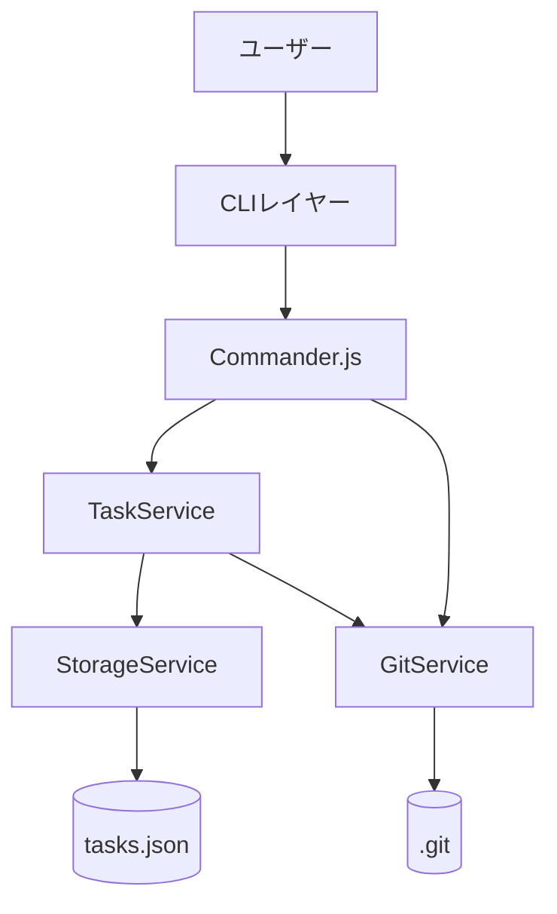
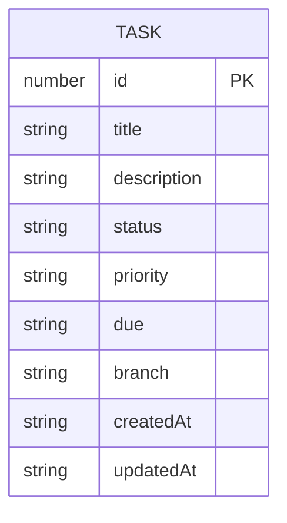
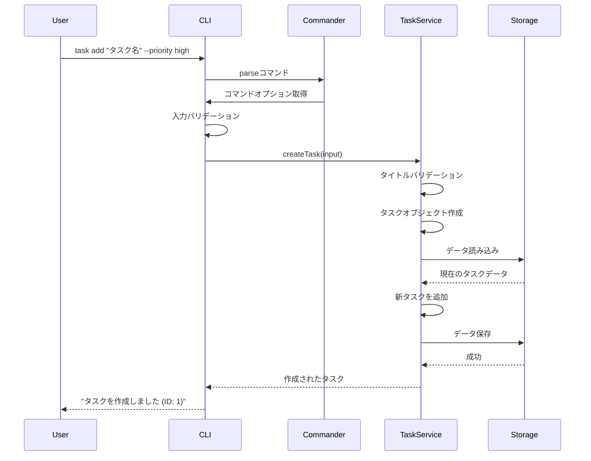
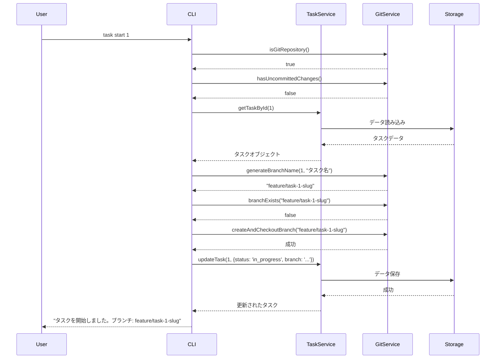
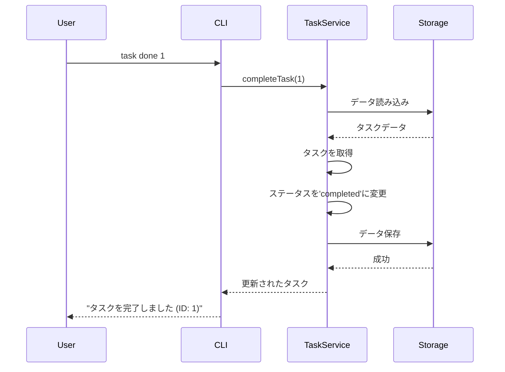
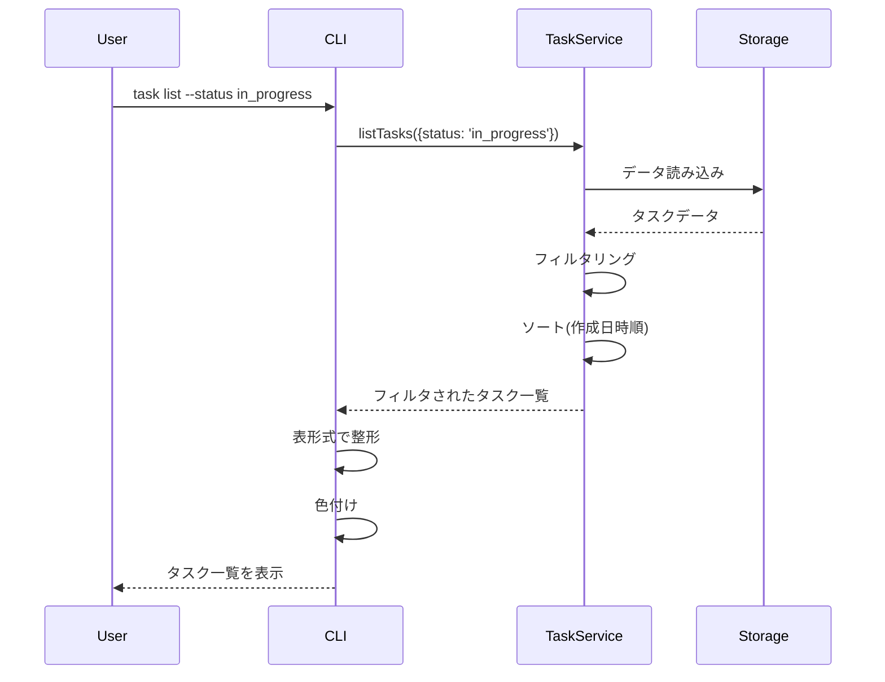

# 機能設計書 (Functional Design Document)

## システム構成図

### 全体アーキテクチャ



### レイヤー構成

**3層アーキテクチャ**:
- **CLIレイヤー**: ユーザー入力の受付、バリデーション、結果の表示
- **サービスレイヤー**: ビジネスロジックの実装(TaskService、GitService)
- **データレイヤー**: データの永続化と取得(StorageService)

## 技術スタック

| 分類 | 技術 | 選定理由 |
|------|------|----------|
| 言語 | TypeScript 5.x | 型安全性、開発効率の向上、エディタサポート |
| CLIフレームワーク | Commander.js | シンプル、学習コストが低い、豊富な実績 |
| Git操作 | simple-git | Node.js標準、Promise対応、API が直感的 |
| GitHub API | Octokit (P1で使用) | GitHub公式ライブラリ、型定義完備 |
| データ保存 | JSON (fs/promises) | シンプル、Gitで管理可能、外部依存なし |
| テスト | Jest | TypeScript対応、豊富な機能、業界標準 |
| リンター | ESLint | コード品質の維持、TypeScript対応 |
| フォーマッター | Prettier | コードスタイルの統一 |

## データモデル定義

### エンティティ: Task

```typescript
interface Task {
  id: number;                    // 連番ID (1, 2, 3, ...)
  title: string;                 // タイトル (1-200文字)
  description?: string;          // オプション、詳細説明
  status: TaskStatus;            // ステータス
  priority: TaskPriority;        // 優先度
  due?: string;                  // 期限 (ISO 8601形式: "2025-01-20")
  branch?: string;               // 紐付けられたGitブランチ名
  createdAt: string;             // 作成日時 (ISO 8601)
  updatedAt: string;             // 更新日時 (ISO 8601)
}

type TaskStatus = 'open' | 'in_progress' | 'completed' | 'archived';
type TaskPriority = 'low' | 'medium' | 'high' | 'critical';

interface TaskData {
  tasks: Task[];                 // タスクの配列
  nextId: number;                // 次に割り当てるID
}
```

**制約**:
- `id`: 1から始まる連番、削除されても欠番として扱う
- `title`: 必須、1-200文字
- `status`: デフォルトは`open`
- `priority`: デフォルトは`medium`
- `due`: オプション、ISO 8601形式の日付文字列
- `branch`: `task start`実行時に自動設定
- 日時フィールドは全てISO 8601形式の文字列

### ER図



**注**: MVP版では単一エンティティのみ。P1以降でGitHub Issueとのリレーションを追加予定。

## コンポーネント設計

### CLIレイヤー

#### CLI (Command Line Interface)

**責務**:
- ユーザー入力の受付
- コマンドのパース
- 結果の表示(表形式、色付け)
- エラーメッセージの表示

**インターフェース**:
```typescript
class CLI {
  // Commander.jsプログラムを初期化
  initializeCommands(program: Command): void;

  // タスク一覧を表形式で表示
  displayTaskList(tasks: Task[]): void;

  // タスク詳細を表示
  displayTaskDetail(task: Task): void;

  // 成功メッセージを表示
  displaySuccess(message: string): void;

  // エラーメッセージを表示
  displayError(error: Error): void;

  // 確認プロンプトを表示
  confirmAction(message: string): Promise<boolean>;
}
```

**依存関係**:
- Commander.js (コマンドパース)
- chalk (色付け)
- cli-table3 (表形式表示)
- inquirer (確認プロンプト)

### サービスレイヤー

#### TaskService

**責務**:
- タスクのCRUD操作
- ビジネスロジックの実装
- バリデーション

**インターフェース**:
```typescript
interface CreateTaskInput {
  title: string;
  description?: string;
  priority?: TaskPriority;
  due?: string;
}

interface UpdateTaskInput {
  title?: string;
  description?: string;
  status?: TaskStatus;
  priority?: TaskPriority;
  due?: string;
  branch?: string;
}

interface ListTasksOptions {
  status?: TaskStatus | TaskStatus[];
  priority?: TaskPriority | TaskPriority[];
  sort?: 'created' | 'updated' | 'priority' | 'due';
  includeArchived?: boolean;
}

class TaskService {
  constructor(private storage: StorageService) {}

  // タスクを作成
  createTask(input: CreateTaskInput): Task;

  // タスク一覧を取得
  listTasks(options?: ListTasksOptions): Task[];

  // IDでタスクを取得
  getTaskById(id: number): Task | null;

  // タスクを更新
  updateTask(id: number, input: UpdateTaskInput): Task;

  // タスクを削除
  deleteTask(id: number): void;

  // タスクを完了にする
  completeTask(id: number): Task;

  // タスクをアーカイブ
  archiveTask(id: number): Task;

  // 現在作業中のタスクを取得
  getCurrentTask(): Task | null;

  // タイトルのバリデーション
  private validateTitle(title: string): void;

  // 期限のバリデーション
  private validateDueDate(due: string): void;
}
```

**依存関係**:
- StorageService (データ永続化)

#### GitService

**責務**:
- Git操作(ブランチ作成、切り替え、ステータス確認)
- Gitリポジトリの存在確認
- ブランチ名の生成

**インターフェース**:
```typescript
class GitService {
  // Gitリポジトリが存在するか確認
  isGitRepository(): Promise<boolean>;

  // 現在のブランチ名を取得
  getCurrentBranch(): Promise<string>;

  // 未コミットの変更があるか確認
  hasUncommittedChanges(): Promise<boolean>;

  // ブランチを作成して切り替え
  createAndCheckoutBranch(branchName: string): Promise<void>;

  // 既存のブランチに切り替え
  checkoutBranch(branchName: string): Promise<void>;

  // ブランチが存在するか確認
  branchExists(branchName: string): Promise<boolean>;

  // タスクIDとタイトルからブランチ名を生成
  generateBranchName(taskId: number, title: string): string;

  // タイトルからスラッグを生成
  private generateSlug(title: string): string;
}
```

**依存関係**:
- simple-git (Git操作)

**ブランチ名生成ロジック**:
```typescript
generateBranchName(taskId: number, title: string): string {
  const slug = this.generateSlug(title);
  return `feature/task-${taskId}-${slug}`;
}

private generateSlug(title: string): string {
  return title
    .toLowerCase()                    // 小文字化
    .replace(/[^a-z0-9\s-]/g, '')    // 英数字とスペース、ハイフンのみ
    .trim()                           // 前後の空白削除
    .replace(/\s+/g, '-')             // スペースをハイフンに
    .substring(0, 50);                // 最大50文字
}
```

**例**:
- タイトル: "ユーザー認証機能の実装" → ブランチ: `feature/task-1-`
- タイトル: "Fix login bug" → ブランチ: `feature/task-2-fix-login-bug`

### データレイヤー

#### StorageService

**責務**:
- JSONファイルへのデータ保存・読み込み
- ファイルの存在確認
- データの初期化

**インターフェース**:
```typescript
class StorageService {
  private readonly dataPath: string = '.task/tasks.json';

  // データを読み込む
  load(): TaskData;

  // データを保存する
  save(data: TaskData): void;

  // ファイルが存在するか確認
  exists(): boolean;

  // 初期データを作成
  initialize(): void;

  // データの整合性を検証
  private validate(data: any): data is TaskData;
}
```

**依存関係**:
- fs/promises (ファイル操作)

**ファイルパス**: `.task/tasks.json`

## ユースケース図

### ユースケース1: タスク追加



**フロー説明**:
1. ユーザーが`task add`コマンドを実行
2. Commander.jsがコマンドをパース
3. CLIが入力をバリデーション(タイトルが空でないか)
4. TaskServiceがタスクオブジェクトを作成
5. タイトルが1-200文字か検証
6. Storageから現在のデータを読み込み
7. 新しいタスクを追加し、nextIdをインクリメント
8. Storageにデータを保存
9. 成功メッセージを表示

### ユースケース2: タスク開始(Gitブランチ連携)



**フロー説明**:
1. ユーザーが`task start <id>`コマンドを実行
2. Gitリポジトリの存在を確認
3. 未コミットの変更があるか確認(ある場合は警告)
4. タスクIDでタスクを取得
5. ブランチ名を生成(`feature/task-{id}-{slug}`)
6. ブランチが既に存在するか確認
7. 存在しない場合: ブランチを作成して切り替え
8. 存在する場合: ブランチに切り替えのみ
9. タスクのステータスを`in_progress`に更新、ブランチ名を記録
10. 成功メッセージとブランチ名を表示

### ユースケース3: タスク完了



**フロー説明**:
1. ユーザーが`task done <id>`コマンドを実行
2. TaskServiceがタスクを取得
3. ステータスを`completed`に変更
4. updatedAtを現在時刻に更新
5. データを保存
6. 成功メッセージを表示

### ユースケース4: タスク一覧表示



**フロー説明**:
1. ユーザーが`task list`コマンドを実行(オプションでフィルタ)
2. TaskServiceがタスク一覧を取得
3. ステータス、優先度でフィルタリング
4. 指定されたソート順でソート(デフォルトは作成日時)
5. CLIが表形式で整形
6. ステータスごとに色分け
7. ユーザーに表示

## UI設計

### テーブル表示

**タスク一覧のフォーマット**:
```
ID  Status       Title                      Branch                              Priority  Due
1   in_progress  ユーザー認証機能の実装      feature/task-1-user-authentication  medium    -
2   open         データエクスポート機能      -                                   high      2025-01-20
3   completed    初期セットアップ           feature/task-3-initial-setup        low       -
```

**表示項目**:
| 項目 | 説明 | フォーマット |
|------|------|-------------|
| ID | タスクID | 数値 |
| Status | ステータス | open/in_progress/completed/archived |
| Title | タイトル | 文字列(50文字で切り詰め) |
| Branch | ブランチ名 | 文字列(未設定時は"-") |
| Priority | 優先度 | low/medium/high/critical |
| Due | 期限 | YYYY-MM-DD形式(未設定時は"-") |

### カラーコーディング

**ステータスの色分け**:
- `completed`: 緑 (chalk.green)
- `in_progress`: 黄 (chalk.yellow)
- `open`: 白 (chalk.white)
- `archived`: グレー (chalk.gray)

**優先度の色分け**:
- `critical`: 赤太字 (chalk.red.bold)
- `high`: 赤 (chalk.red)
- `medium`: 黄 (chalk.yellow)
- `low`: 青 (chalk.blue)

**期限の色分け**:
- 期限切れ: 赤 (chalk.red)
- 期限まで3日以内: 黄 (chalk.yellow)
- それ以外: 白 (chalk.white)

### タスク詳細表示

```
タスク詳細 (ID: 1)
━━━━━━━━━━━━━━━━━━━━━━━━━━━━━━━━━━━━━━━━
タイトル:     ユーザー認証機能の実装
説明:         JWT認証を使用したユーザー認証機能
ステータス:   in_progress (進行中)
優先度:       medium (中)
ブランチ:     feature/task-1-user-authentication
期限:         -
作成日時:     2025-01-10 10:00:00
更新日時:     2025-01-10 11:30:00
━━━━━━━━━━━━━━━━━━━━━━━━━━━━━━━━━━━━━━━━
```

## ファイル構造

### データ保存形式

```
.task/
├── tasks.json      # タスクデータ
└── backups/        # バックアップ(将来実装)
    └── tasks.json.YYYYMMDD_HHMMSS.bak
```

### tasks.json の例

```json
{
  "tasks": [
    {
      "id": 1,
      "title": "ユーザー認証機能の実装",
      "description": "JWT認証を使用したユーザー認証機能",
      "status": "in_progress",
      "priority": "medium",
      "due": "2025-01-20",
      "branch": "feature/task-1-user-authentication",
      "createdAt": "2025-01-10T10:00:00.000Z",
      "updatedAt": "2025-01-10T11:30:00.000Z"
    },
    {
      "id": 2,
      "title": "データエクスポート機能",
      "status": "open",
      "priority": "high",
      "createdAt": "2025-01-11T09:00:00.000Z",
      "updatedAt": "2025-01-11T09:00:00.000Z"
    }
  ],
  "nextId": 3
}
```

**初期データ**:
```json
{
  "tasks": [],
  "nextId": 1
}
```

## コマンド設計

### タスクの基本操作

#### task add

```bash
task add <title> [options]

オプション:
  --priority <priority>   優先度 (low/medium/high/critical)
  --due <date>            期限 (YYYY-MM-DD形式)
  --description <desc>    説明

例:
  task add "ユーザー認証機能の実装"
  task add "バグ修正" --priority high --due 2025-01-20
```

#### task list

```bash
task list [options]

オプション:
  --status <status>       ステータスでフィルタ (open/in_progress/completed)
  --priority <priority>   優先度でフィルタ (low/medium/high/critical)
  --sort <field>          ソート (created/updated/priority/due)
  --all                   アーカイブ済みも含めて表示

例:
  task list
  task list --status in_progress
  task list --priority high --sort due
```

#### task show

```bash
task show <id>

例:
  task show 1
```

#### task done

```bash
task done <id>

例:
  task done 1
```

#### task delete

```bash
task delete <id>

例:
  task delete 1
```

### Gitブランチ連携

#### task start

```bash
task start <id>

例:
  task start 1
```

**動作**:
1. Gitリポジトリの存在確認
2. 未コミットの変更を確認(ある場合は警告)
3. ブランチ名を生成
4. ブランチを作成して切り替え(既存の場合は切り替えのみ)
5. タスクのステータスを`in_progress`に変更

#### task current

```bash
task current

例:
  task current
```

**動作**:
- ステータスが`in_progress`のタスクを表示

#### task stop

```bash
task stop

例:
  task stop
```

**動作**:
1. 現在作業中のタスクを取得
2. ステータスを`open`に戻す
3. ブランチはそのまま維持

### ステータス管理

#### task status

```bash
task status <id> <status>

例:
  task status 1 in_progress
  task status 1 completed
```

#### task archive

```bash
task archive <id>

例:
  task archive 1
```

## パフォーマンス最適化

### MVP版の最適化

- **ファイル読み込みの最小化**: コマンド実行時に1回だけ読み込み
- **メモリ内操作**: データ変更はメモリ内で実行し、最後に1回保存
- **同期処理**: MVP版では非同期は最小限(simple-gitのみ)

### 将来的な最適化(タスク数が増えた場合)

- **キャッシュ機構**: 頻繁にアクセスするデータをメモリにキャッシュ
- **インデックス**: タスクIDでのアクセスを高速化
- **SQLite移行**: 10,000件を超える場合はSQLiteに移行

## セキュリティ考慮事項

### MVP版のセキュリティ

- **ファイル権限**: `.task/`ディレクトリのパーミッションを600に設定
- **入力バリデーション**: タイトル、期限のバリデーションを徹底
- **パストラバーサル対策**: ファイルパスは固定(`.task/tasks.json`)

### 将来的なセキュリティ(P1以降)

- **GitHub Token**: 環境変数または安全なキーチェーンに保存
- **平文保存禁止**: 認証情報をJSONファイルに平文で保存しない

## エラーハンドリング

### エラーの分類

| エラー種別 | 処理 | ユーザーへの表示 |
|-----------|------|-----------------|
| 入力検証エラー | 処理を中断、エラーメッセージ表示 | "タイトルは1-200文字で入力してください" |
| タスクが見つからない | 処理を中断、エラーメッセージ表示 | "タスクが見つかりません (ID: xxx)" |
| ファイル読み込みエラー | 初期データで継続 | "データファイルが見つかりません。新規作成します" |
| JSON解析エラー | エラーを表示、終了 | "データファイルが破損しています" |
| Gitリポジトリなし | エラーを表示、終了 | "Gitリポジトリが見つかりません" |
| 未コミットの変更あり | 警告を表示、継続確認 | "未コミットの変更があります。続行しますか?" |
| ブランチ作成失敗 | エラーを表示、終了 | "ブランチの作成に失敗しました: <詳細>" |
| ファイル書き込みエラー | エラーを表示、終了 | "データの保存に失敗しました" |

### エラーハンドリングの実装方針

**カスタムエラークラス**:
```typescript
class TaskError extends Error {
  constructor(message: string, public code: string) {
    super(message);
    this.name = 'TaskError';
  }
}

class ValidationError extends TaskError {
  constructor(message: string) {
    super(message, 'VALIDATION_ERROR');
  }
}

class NotFoundError extends TaskError {
  constructor(message: string) {
    super(message, 'NOT_FOUND');
  }
}

class StorageError extends TaskError {
  constructor(message: string) {
    super(message, 'STORAGE_ERROR');
  }
}

class GitError extends TaskError {
  constructor(message: string) {
    super(message, 'GIT_ERROR');
  }
}
```

**エラーハンドリングのフロー**:
1. 各サービスで適切なカスタムエラーをスロー
2. CLIレイヤーでキャッチ
3. エラーコードに応じたメッセージを表示
4. 終了コードを設定(0=成功、1=エラー)

## テスト戦略

### ユニットテスト

**テスト対象**:
- TaskService の各メソッド
  - createTask: タスク作成、バリデーション
  - listTasks: フィルタリング、ソート
  - updateTask: 更新処理
  - deleteTask: 削除処理
- GitService の各メソッド
  - generateBranchName: ブランチ名生成
  - generateSlug: スラッグ生成
- StorageService の各メソッド
  - load: データ読み込み
  - save: データ保存
  - validate: データ検証

**モック対象**:
- StorageService: ファイルI/Oをモック
- simple-git: Git操作をモック

### 統合テスト

**テストシナリオ**:
1. タスク作成 → 一覧表示 → 詳細表示 → 完了 → 削除
2. タスク作成 → 開始(ブランチ作成) → 完了
3. タスク作成 → フィルタリング → ソート
4. エラーケース: 存在しないタスクの取得、無効な入力

### E2Eテスト

**テストシナリオ**:
1. 実際のCLIコマンドを実行
2. 実際のファイルシステムとGitリポジトリを使用
3. ユーザーの典型的なワークフローをシミュレート

**例**:
```bash
# タスク作成
task add "テストタスク" --priority high

# 一覧表示
task list

# タスク開始
task start 1

# Gitブランチ確認
git branch

# タスク完了
task done 1

# 一覧表示(完了を確認)
task list
```

## 実装の優先順位

### Phase 1: コア機能(MVP)

1. **データモデルとStorageService**: タスクデータの保存・読み込み
2. **TaskService**: タスクのCRUD操作
3. **CLI**: 基本コマンド(add/list/show/done/delete)
4. **GitService**: ブランチ操作(start/current/stop)
5. **エラーハンドリング**: 基本的なエラー処理

### Phase 2: ユーザビリティ向上

6. **UI改善**: 色付け、表形式表示
7. **確認プロンプト**: 削除時の確認
8. **ヘルプコマンド**: 各コマンドの詳細ヘルプ

### Phase 3: テストとドキュメント

9. **ユニットテスト**: 80%以上のカバレッジ
10. **E2Eテスト**: 主要ワークフローのテスト
11. **README**: インストール、使い方、コマンド一覧

---

**最終更新日**: 2025-01-03
**バージョン**: 1.0
**作成者**: Claude Code
