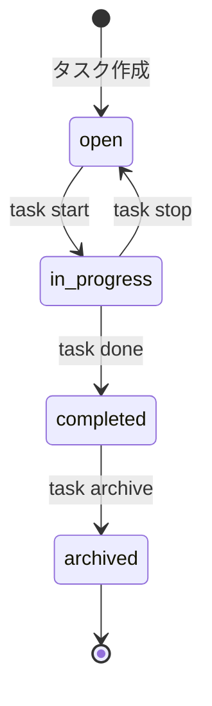

# プロジェクト用語集 (Glossary)

## 概要

このドキュメントは、TaskCLIプロジェクト内で使用される用語の定義を管理します。

**更新日**: 2025-01-03

## ドメイン用語

プロジェクト固有のビジネス概念や機能に関する用語。

### タスク (Task)

**定義**: ユーザーが完了すべき作業の単位

**説明**: タスクはID、タイトル、説明、ステータス、優先度、期限、作成日時、更新日時を持ち、ユーザーの作業を管理する基本単位です。Gitブランチと紐付けることで、コード作業とタスク管理を統合します。

**関連用語**: [タスクステータス](#タスクステータス-task-status)、[優先度](#優先度-priority)、[ブランチ連携](#ブランチ連携-branch-integration)

**使用例**:
- `task add "ユーザー認証機能の実装"`: 新しいタスクを作成
- `task list`: タスク一覧を表示
- `task done 1`: タスクを完了状態に変更

**データモデル**: `src/types/Task.ts`

**英語表記**: Task

### ブランチ連携 (Branch Integration)

**定義**: タスクとGitブランチを自動的に紐付ける機能

**説明**: タスク開始時に自動的にGitブランチを作成・切り替えし、タスクIDとタイトルから生成されたブランチ名で作業を行います。これにより、どのタスクのためにどのブランチで作業しているかが常に明確になります。

**関連用語**: [タスク](#タスク-task)、[GitService](#gitservice)

**使用例**:
- `task start 1`: タスク開始時にブランチ`feature/task-1-slug`を自動作成・切り替え
- `task current`: 現在作業中のタスクとブランチを表示

**ブランチ命名規則**: `feature/task-{id}-{slug}`
- `{id}`: タスクID
- `{slug}`: タイトルから生成されたスラッグ(小文字、ハイフン区切り、最大50文字)

**実装**: `src/services/GitService.ts`

**英語表記**: Branch Integration

### ステアリングファイル (Steering File)

**定義**: 特定の開発作業における「今回何をするか」を定義する作業単位のドキュメント

**説明**: `.steering/[YYYYMMDD]-[タスク名]/` ディレクトリに配置され、作業の要求内容(requirements.md)、設計(design.md)、タスクリスト(tasklist.md)を含みます。作業ごとに新規作成し、履歴として保持します。

**関連用語**: [永続ドキュメント](#永続ドキュメント-persistent-document)

**使用例**:
- `.steering/20250110-mvp-implementation/`: MVP実装の作業ドキュメント
- `.steering/20250120-github-integration/`: GitHub連携機能の作業ドキュメント

**ディレクトリ構造**:
```
.steering/
└── [YYYYMMDD]-[task-name]/
    ├── requirements.md      # 今回の作業の要求内容
    ├── design.md            # 変更内容の設計
    └── tasklist.md          # タスクリスト
```

**命名規則**: `20250115-add-user-profile` 形式

**英語表記**: Steering File

### 永続ドキュメント (Persistent Document)

**定義**: プロジェクト全体の「何を作るか」「どう作るか」を定義する長期保存されるドキュメント

**説明**: `docs/` ディレクトリに配置され、PRD、機能設計書、アーキテクチャ設計書、リポジトリ構造定義書、開発ガイドライン、用語集の6つから構成されます。プロジェクトの「北極星」として機能し、頻繁には更新されません。

**関連用語**: [ステアリングファイル](#ステアリングファイル-steering-file)

**配置ドキュメント**:
- `docs/product-requirements.md`: プロダクト要求定義書
- `docs/functional-design.md`: 機能設計書
- `docs/architecture.md`: アーキテクチャ設計書
- `docs/repository-structure.md`: リポジトリ構造定義書
- `docs/development-guidelines.md`: 開発ガイドライン
- `docs/glossary.md`: 用語集(本ドキュメント)

**英語表記**: Persistent Document

## ステータス・状態

システム内で使用される各種ステータスの定義。

### タスクステータス (Task Status)

**定義**: タスクの進行状態を示す列挙型

**取りうる値**:

| ステータス | 意味 | 遷移条件 | 次の状態 |
|----------|------|---------|---------|
| `open` | 新規作成、未着手 | タスク作成時の初期状態 | `in_progress` |
| `in_progress` | 作業中 | `task start`実行時 | `completed`, `open` |
| `completed` | 完了 | `task done`実行時 | `archived` |
| `archived` | アーカイブ済み | `task archive`実行時 | - |

**状態遷移図**:


**実装**:
```typescript
// src/types/Task.ts
export type TaskStatus = 'open' | 'in_progress' | 'completed' | 'archived';
```

**英語表記**: Task Status

### 優先度 (Priority)

**定義**: タスクの緊急度・重要度を示す4段階の指標

**取りうる値**:

| 優先度 | 意味 | 判断基準 |
|--------|------|---------|
| `critical` | 緊急 | 即座に対応が必要、他のタスクをブロック |
| `high` | 高 | 期限が3日以内、重要な機能 |
| `medium` | 中 | 期限が1週間以内、通常の作業(デフォルト) |
| `low` | 低 | 期限が1週間以上先、優先度が低い |

**実装**:
```typescript
// src/types/Task.ts
export type TaskPriority = 'low' | 'medium' | 'high' | 'critical';
```

**使用例**:
```bash
task add "緊急バグ修正" --priority critical
task add "新機能追加" --priority high
task add "ドキュメント更新" --priority low
```

**英語表記**: Priority

## データモデル用語

データベース・データ構造に関する用語。

### Task

**定義**: タスクを表すメインのデータモデル

**主要フィールド**:
- `id: number`: タスクの一意識別子(連番)
- `title: string`: タスクのタイトル(1-200文字、必須)
- `description?: string`: タスクの詳細説明(オプション)
- `status: TaskStatus`: タスクのステータス
- `priority: TaskPriority`: タスクの優先度
- `due?: string`: タスクの期限(ISO 8601形式、オプション)
- `branch?: string`: 紐付けられたGitブランチ名
- `createdAt: string`: 作成日時(ISO 8601形式)
- `updatedAt: string`: 更新日時(ISO 8601形式)

**関連エンティティ**: [TaskData](#taskdata)

**制約**:
- `id`: 1から始まる連番、削除されても欠番として扱う
- `title`: 必須、1-200文字
- `status`: デフォルトは`open`
- `priority`: デフォルトは`medium`

**実装**: `src/types/Task.ts`

### TaskData

**定義**: タスクデータの永続化形式

**主要フィールド**:
- `tasks: Task[]`: タスクの配列
- `nextId: number`: 次に割り当てるタスクID

**関連エンティティ**: [Task](#task)

**ファイル保存場所**: `.task/tasks.json`

**実装**: `src/types/Task.ts`

**例**:
```json
{
  "tasks": [
    {
      "id": 1,
      "title": "ユーザー認証機能の実装",
      "status": "in_progress",
      "priority": "medium",
      "createdAt": "2025-01-10T10:00:00.000Z",
      "updatedAt": "2025-01-10T11:30:00.000Z"
    }
  ],
  "nextId": 2
}
```

### CreateTaskInput

**定義**: タスク作成時の入力データ型

**主要フィールド**:
- `title: string`: タスクのタイトル(必須)
- `description?: string`: タスクの説明(オプション)
- `priority?: TaskPriority`: 優先度(オプション、デフォルト: `medium`)
- `due?: string`: 期限(オプション)

**実装**: `src/types/Task.ts`

**使用例**:
```typescript
const input: CreateTaskInput = {
  title: '新しいタスク',
  priority: 'high',
  due: '2025-01-20'
};
```

## 技術用語

プロジェクトで使用している技術・フレームワーク・ツールに関する用語。

### TypeScript

**定義**: JavaScriptに静的型付けを追加したプログラミング言語

**公式サイト**: https://www.typescriptlang.org/

**本プロジェクトでの用途**: 全てのソースコードをTypeScriptで記述し、型安全性を確保

**バージョン**: 5.x

**選定理由**:
- コンパイル時の型チェックによるバグの早期発見
- エディタの補完機能による開発効率向上
- チーム開発における型定義の共有で保守性向上

**関連ドキュメント**: [アーキテクチャ設計書](./architecture.md#技術スタック)

**設定ファイル**: `tsconfig.json`

### Commander.js

**定義**: Node.js用のCLIフレームワーク

**公式サイト**: https://github.com/tj/commander.js

**本プロジェクトでの用途**: CLIのコマンドパース、オプション処理、ヘルプ生成

**バージョン**: ^12.0.0

**選定理由**:
- シンプルで学習コストが低い
- Gitコマンド風のインターフェースを実現しやすい
- 豊富な実績と安定性

**使用箇所**: `src/cli/CLI.ts`

**関連ドキュメント**: [機能設計書](./functional-design.md#CLIレイヤー)

### simple-git

**定義**: Node.js用のGitライブラリ

**公式サイト**: https://github.com/steveukx/git-js

**本プロジェクトでの用途**: Gitブランチの作成・切り替え、ステータス確認

**バージョン**: ^3.25.0

**選定理由**:
- Promise対応で非同期処理が容易
- APIが直感的で使いやすい
- TypeScript型定義が完備

**使用箇所**: `src/services/GitService.ts`

### Jest

**定義**: JavaScript/TypeScript用のテストフレームワーク

**公式サイト**: https://jestjs.io/

**本プロジェクトでの用途**: ユニットテスト、統合テスト、E2Eテストの実行

**バージョン**: ^29.7.0

**選定理由**:
- TypeScript対応が標準装備
- モック機能が充実
- カバレッジレポート標準装備

**関連ドキュメント**: [開発ガイドライン](./development-guidelines.md#テスト戦略)

**設定ファイル**: `jest.config.js`

### chalk

**定義**: ターミナル出力に色を付けるライブラリ

**公式サイト**: https://github.com/chalk/chalk

**本プロジェクトでの用途**: タスク一覧の色分け、エラーメッセージの強調表示

**バージョン**: 5.3.0

**選定理由**:
- 軽量で高速
- APIがシンプル
- クロスプラットフォーム対応

**使用箇所**: `src/cli/formatters/`

### cli-table3

**定義**: CLIで表形式のデータを表示するライブラリ

**公式サイト**: https://github.com/cli-table/cli-table3

**本プロジェクトでの用途**: タスク一覧の表形式表示

**バージョン**: ^0.6.5

**選定理由**:
- 柔軟なテーブルレイアウト
- Unicode対応
- カスタマイズ性が高い

**使用箇所**: `src/cli/formatters/TableFormatter.ts`

## 略語・頭字語

### CLI

**正式名称**: Command Line Interface

**意味**: コマンドラインから操作するインターフェース

**本プロジェクトでの使用**: TaskCLIツールのメインインターフェース。ユーザーは`task add "タスク"`のようなコマンドでタスクを操作します。

**実装**: `src/cli/` ディレクトリ

### MVP

**正式名称**: Minimum Viable Product

**意味**: 最小限の機能でリリースする製品

**本プロジェクトでの使用**: P0機能(タスク基本操作、Gitブランチ連携、ステータス管理、一覧表示、データ永続化)をMVPとして定義

**関連ドキュメント**: [プロダクト要求定義書](./product-requirements.md#MVP)

### PRD

**正式名称**: Product Requirements Document

**意味**: プロダクト要求定義書

**本プロジェクトでの使用**: 永続ドキュメントの1つ。プロダクトの要件を定義する基本ドキュメント

**ファイル**: `docs/product-requirements.md`

### TDD

**正式名称**: Test-Driven Development

**意味**: テスト駆動開発。テストを先に書いてから実装を行う開発手法

**本プロジェクトでの適用**: 全ての新機能開発でTDDを推奨

**手順**:
1. テストを書く
2. テストを実行 → 失敗を確認
3. 実装を書く
4. テストを実行 → 成功を確認
5. リファクタリング

**関連ドキュメント**: [開発ガイドライン](./development-guidelines.md#テスト戦略)

### API

**正式名称**: Application Programming Interface

**意味**: アプリケーション間の連携インターフェース

**本プロジェクトでの使用**: GitHub API(P1以降)との連携でタスクとIssuesを同期

## アーキテクチャ用語

システム設計・アーキテクチャに関する用語。

### レイヤードアーキテクチャ (Layered Architecture)

**定義**: システムを役割ごとに複数の層に分割し、上位層から下位層への一方向の依存関係を持たせる設計パターン

**本プロジェクトでの適用**: 3層アーキテクチャを採用

```
CLIレイヤー (src/cli/)
    ↓
サービスレイヤー (src/services/)
    ↓
データレイヤー (src/storage/)
```

**各層の責務**:
- **CLIレイヤー**: ユーザー入力の受付、バリデーション、結果の表示
- **サービスレイヤー**: ビジネスロジックの実装、タスク操作、Git操作
- **データレイヤー**: データの永続化、ファイルI/O

**メリット**:
- 関心の分離による保守性向上
- テストが容易(各層を独立してテスト可能)
- 変更の影響範囲が限定的

**依存関係のルール**:
- ✅ CLIレイヤー → サービスレイヤー
- ✅ サービスレイヤー → データレイヤー
- ❌ データレイヤー → サービスレイヤー
- ❌ データレイヤー → CLIレイヤー

**実装箇所**: `src/` ディレクトリの構造に反映

**関連ドキュメント**: [アーキテクチャ設計書](./architecture.md#アーキテクチャパターン)

### サービスレイヤー (Service Layer)

**定義**: ビジネスロジックを実装する層

**本プロジェクトでの適用**: TaskServiceとGitServiceの2つのサービスで構成

**主要コンポーネント**:
- **TaskService**: タスクのCRUD操作、ビジネスロジック
- **GitService**: Git操作、ブランチ名生成

**責務**:
- ビジネスロジックの実装
- データ変換(入力データ → タスクオブジェクト)
- バリデーション(タイトル、期限の妥当性チェック)

**実装**: `src/services/`

## エラー・例外

システムで定義されているエラーと例外。

### TaskError

**クラス名**: `TaskError`

**継承元**: `Error`

**発生条件**: TaskCLI固有のエラーの基底クラス

**実装箇所**: `src/errors/TaskError.ts`

**使用例**:
```typescript
class TaskError extends Error {
  constructor(message: string, public code: string) {
    super(message);
    this.name = 'TaskError';
  }
}
```

### ValidationError

**クラス名**: `ValidationError`

**継承元**: `TaskError`

**発生条件**: ユーザー入力がビジネスルールに違反した場合

**エラーメッセージフォーマット**: `[エラー内容]`

**対処方法**:
- ユーザー: エラーメッセージに従って入力を修正
- 開発者: バリデーションロジックが正しいか確認

**ログレベル**: WARN (ユーザー起因のエラー)

**実装箇所**: `src/errors/ValidationError.ts`

**使用例**:
```typescript
if (!title || title.trim().length === 0) {
  throw new ValidationError('タイトルは必須です');
}

if (title.length > 200) {
  throw new ValidationError('タイトルは200文字以内で入力してください');
}
```

**関連するバリデーション**:
- タイトル: 1-200文字、必須
- 期限: ISO 8601形式の日付
- 優先度: low/medium/high/criticalのいずれか

### NotFoundError

**クラス名**: `NotFoundError`

**継承元**: `TaskError`

**発生条件**: 指定されたタスクIDが存在しない場合

**エラーメッセージフォーマット**: `Task not found: {id}`

**対処方法**:
- ユーザー: `task list`で存在するタスクIDを確認
- 開発者: タスクIDの存在確認ロジックを検証

**ログレベル**: WARN

**実装箇所**: `src/errors/NotFoundError.ts`

**使用例**:
```typescript
const task = taskData.tasks.find(t => t.id === id);
if (!task) {
  throw new NotFoundError('Task', id);
}
```

### StorageError

**クラス名**: `StorageError`

**継承元**: `TaskError`

**発生条件**: ファイルの読み書きに失敗した場合

**エラーメッセージフォーマット**: `[操作内容]: [詳細]`

**対処方法**:
- ユーザー: ディスク容量を確認、ファイルパーミッションを確認
- 開発者: エラーの詳細をログから確認、バックアップから復元

**ログレベル**: ERROR

**実装箇所**: `src/errors/StorageError.ts`

**使用例**:
```typescript
try {
  await fs.writeFile('.task/tasks.json', JSON.stringify(data));
} catch (error) {
  throw new StorageError('データの保存に失敗しました', error as Error);
}
```

### GitError

**クラス名**: `GitError`

**継承元**: `TaskError`

**発生条件**: Git操作(ブランチ作成、切り替え等)に失敗した場合

**エラーメッセージフォーマット**: `[Git操作]: [詳細]`

**対処方法**:
- ユーザー: Gitリポジトリが存在するか確認、未コミットの変更を確認
- 開発者: Git操作のエラーハンドリングを確認

**ログレベル**: ERROR

**実装箇所**: `src/errors/GitError.ts`

**使用例**:
```typescript
const isGitRepo = await simpleGit().checkIsRepo();
if (!isGitRepo) {
  throw new GitError('Gitリポジトリが見つかりません');
}
```

## コンポーネント用語

### TaskService

**定義**: タスクのCRUD操作とビジネスロジックを実装するサービスクラス

**主要メソッド**:
- `createTask(input: CreateTaskInput): Task`: タスク作成
- `listTasks(options?: ListTasksOptions): Task[]`: タスク一覧取得
- `getTaskById(id: number): Task | null`: タスク取得
- `updateTask(id: number, input: UpdateTaskInput): Task`: タスク更新
- `deleteTask(id: number): void`: タスク削除
- `completeTask(id: number): Task`: タスク完了
- `archiveTask(id: number): Task`: タスクアーカイブ

**依存関係**: StorageService

**実装**: `src/services/TaskService.ts`

### GitService

**定義**: Git操作を担当するサービスクラス

**主要メソッド**:
- `isGitRepository(): Promise<boolean>`: Gitリポジトリの存在確認
- `getCurrentBranch(): Promise<string>`: 現在のブランチ名取得
- `hasUncommittedChanges(): Promise<boolean>`: 未コミットの変更確認
- `createAndCheckoutBranch(branchName: string): Promise<void>`: ブランチ作成・切り替え
- `generateBranchName(taskId: number, title: string): string`: ブランチ名生成

**依存関係**: simple-git

**実装**: `src/services/GitService.ts`

### StorageService

**定義**: データの永続化を担当するサービスクラス

**主要メソッド**:
- `load(): TaskData`: データ読み込み
- `save(data: TaskData): void`: データ保存
- `exists(): boolean`: ファイルの存在確認
- `initialize(): void`: 初期データ作成

**データ保存場所**: `.task/tasks.json`

**実装**: `src/storage/StorageService.ts`

---

**最終更新日**: 2025-01-03
**バージョン**: 1.0
**作成者**: Claude Code
